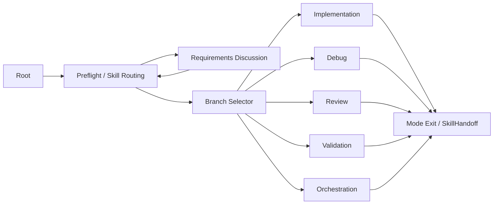

# Workflow Graph 面板功能方案

## 状态

- 状态：推荐落地方案
- 面板入口：`AIBridge/Workflow Graph`
- 关联面板：`AIBridge/Workflows`
- 展示文档：`WorkflowGraphPanel.html`
- 工作底稿：`.aibridge/plan/workflow-graph-panel-plan.md`

## 一句话结论

AIBridge 应新增 **Workflow Graph** 高级面板，用行为树风格节点展示和编辑工作流结构，但不把它定义成传统 Behavior Tree runtime。它是工作流的可视化、受控编辑和生成入口，不是新的 LLM 调度器。

## 背景

当前 AIBridge workflow 由多类文本和结构化文件共同组成：

- RootRule 判断是否进入 workflow。
- `aibridge-development-workflow` 定义 Preflight、Skill 路由、主分支、Mode Enter/Execute/Exit 和验证收尾。
- `project-workflow-preferences.md` 与 `branch-selection.md` 由 `AIBridge/Workflows` 生成。
- Workflow recipe JSON 描述 phase、step、gate、artifact、run 和 report。
- `SkillHandoff` 用于跨模式、跨 phase 或跨 agent 交接。

这些内容对 AI 友好，但对人不够直观。多分支流转、外部 agent/manual step、gate 失败、证据新鲜度和 active run 状态都需要一个图形化视角。

## 产品定位

### `AIBridge/Workflows`

继续保持默认用户配置面板：

- 安装和刷新 Skills。
- 管理推荐 Skill 库。
- 配置 Workflow Options。
- 生成项目级 workflow 偏好文件。

它不应默认承载 recipe 编辑、run 检查、artifact 浏览或 gate 调试。

### `AIBridge/Workflow Graph`

新增独立高级面板：

- 展示 workflow 分支、步骤、门禁、artifact 和 handoff。
- 解释当前任务可能走向哪个分支。
- 展示 active run 当前卡在哪个节点。
- 后续支持受控编辑项目本地 recipe。

`AIBridge/Workflows` 可以提供跳转按钮，但不要把 Workflow Graph 直接并入默认页签。

## 目标

1. 让用户直观看到 AIBridge workflow 的分支和流转。
2. 将文本规则、recipe、run manifest 和 gate 状态投影成统一图。
3. 支持只读解释、运行状态查看和后续项目 recipe 编辑。
4. 避免 Markdown、recipe 和 UI 配置之间产生双源漂移。
5. 保持 AIBridge CLI 和 SkillInstaller 仍是校验与生成的权威路径。

## 非目标

1. 不实现 Unity AI 行为树式 tick runtime。
2. 不让 AIBridge CLI 自动执行 `agent` 或 `manual` step。
3. 不直接编辑已安装 assistant Skill 的 Markdown。
4. 不把默认 `Workflows` 面板变成调试控制台。
5. 不在第一版支持并行写入或跨工具 agent 调度。

## 信息架构

| 视图 | 用途 | 面向用户 |
|---|---|---|
| Routing Graph | 展示 Preflight、需求讨论、主分支和 Mode Exit 流转 | 普通用户 |
| Recipe Graph | 展示 recipe 的 phase、step、dependsOn、gate 和 artifact | 高级用户 |
| Run Graph | 展示 active run 的状态、失败点、缺失 import 和 gate 结果 | 调试用户 |
| Inspector | 展示选中节点来源、说明、状态、可编辑字段和校验结果 | 高级用户 |

## 图模型

Workflow Graph 借鉴行为树表达方式，但使用 AIBridge 自己的节点语义。



### 节点类型

| 类型 | 含义 | 来源 |
|---|---|---|
| Root | 工作流入口 | 固定生成 |
| Preflight | Skill 路由、项目偏好、harness gate | graph manifest |
| Selector | 多分支选择 | branch-selection |
| Sequence | 串行 phase 或步骤 | recipe phase |
| Parallel | 并行只读收集或 review | recipe phase |
| Pipeline | 多阶段逐项处理 | recipe phase |
| Condition | 分支开关、gate 条件、证据新鲜度 | settings / gates |
| Action | CLI、agent、manual、barrier、report step | recipe step |
| Gate | compile、logs、tests、runtime、artifact、verdict | recipe gates |
| Handoff | SkillHandoff、artifact refs、open risks | imported schema |
| Artifact | finding、verdict、screenshot、report 等 | run manifest |

### 状态显示

| 状态 | 建议颜色 | 含义 |
|---|---|---|
| NotStarted | 灰色 | 未进入 |
| Ready | 蓝色 | 可执行 |
| Running | 青色 | 当前执行中 |
| Passed | 绿色 | 已通过 |
| Failed | 红色 | 已失败 |
| Blocked | 橙色 | 被缺失条件阻塞 |
| WaitingExternal | 紫色 | 等待 agent/manual import |
| Stale | 黄色 | 证据过期 |
| Disabled | 淡灰 | 分支或节点被关闭 |

## 数据来源

第一版不要解析散落 Markdown 来反推结构。应新增稳定的 graph manifest。

| 数据 | 来源 | 用途 |
|---|---|---|
| Workflow Options | `AIBridgeProjectSettings.WorkflowUi` | 分支开关、默认验证、Runtime 和 Code Index 偏好 |
| Routing Manifest | `workflow-graph.manifest.json` | 路由图节点和边 |
| Skill 文档 | installed assistant Skills | AI 执行说明和 source refs |
| Recipe | `Templates~/Workflows` 与 `.aibridge/workflows/recipes` | phase、step、gate、artifact |
| Run | `.aibridge/workflows/runs/<runId>/manifest.json` | 状态、artifact、gate、external gap |

## Routing Manifest

建议在 SkillInstaller 生成 preferences 和 branch-selection 时，同步生成：

```text
aibridge-development-workflow/references/workflow-graph.manifest.json
```

示例：

```json
{
  "schemaVersion": 1,
  "kind": "aibridge-workflow-routing-graph",
  "generatedFrom": {
    "assistant": "codex",
    "settingsHash": "<hash>"
  },
  "nodes": [
    {
      "id": "preflight",
      "kind": "Preflight",
      "title": "Preflight / Skill Routing",
      "editable": false
    },
    {
      "id": "branch-implementation",
      "kind": "Action",
      "title": "Implementation Branch",
      "enabledSetting": "EnableImplementationBranch",
      "source": "references/branches/implementation.md",
      "editable": "setting"
    }
  ],
  "edges": [
    {
      "from": "preflight",
      "to": "branch-implementation",
      "condition": "change-oriented task"
    }
  ]
}
```

关键约束：

- Markdown 和 manifest 必须由同一生成器输出。
- UI 读取 manifest，不从 Markdown 猜测结构。
- 修改设置后，重新生成 Markdown 和 manifest。

## 编辑模型

### 阶段 1：只读展示

只读展示必须先落地：

- Routing Graph。
- 内置 recipe graph。
- active run 状态。
- 节点 Inspector。
- source file 跳转。

这一阶段不写任何 workflow 文件。

### 阶段 2：项目 recipe 编辑

允许编辑项目本地 recipe：

- title、description。
- phase 顺序和 `dependsOn`。
- step kind、description、command、outputs。
- gate kind、required 和参数。
- `requiredSkills`、`releaseSkillsAfter`。
- `retryBudget`、`stopWhen`、`terminalState`、`terminalReason`。

保存位置：

```text
.aibridge/workflows/recipes/<name>.aibridge-workflow.json
```

不要直接覆盖 package 内置 template。

保存前必须校验：

```bash
$CLI workflow validate --file <recipe>
$CLI workflow plan --file <recipe> --format markdown
```

### 阶段 3：Skill 生成预览

当图形配置影响 Skill 路由时：

1. 修改 ProjectSettings 或 graph manifest 源数据。
2. 由 SkillInstaller 生成 Markdown 和 manifest。
3. 在 UI 中展示影响文件和 diff preview。
4. 用户确认后刷新对应 assistant 的 Skills。

## 技术方案

### Editor 技术选择

当前 Workflows 面板是 IMGUI。首版 Workflow Graph 建议也使用独立 IMGUI EditorWindow：

- 复用现有包风格。
- 减少对 experimental GraphView 的依赖。
- 先实现自绘节点、连线、平移、缩放和选中 Inspector。
- 保持 graph model 与 renderer 解耦，后续可迁移 UI Toolkit。

### 建议目录

```text
Packages/cn.lys.aibridge/Editor/WorkflowGraph/
  AIBridgeWorkflowGraphWindow.cs
  WorkflowGraphDocument.cs
  WorkflowGraphNode.cs
  WorkflowGraphEdge.cs
  WorkflowGraphLoader.cs
  WorkflowGraphLayout.cs
  WorkflowGraphRenderer.cs
  WorkflowGraphInspector.cs
  WorkflowGraphRecipeAdapter.cs
  WorkflowGraphRunAdapter.cs
```

### 职责划分

| 模块 | 职责 |
|---|---|
| Loader | 读取 settings、manifest、recipe 和 run |
| Adapter | 转成统一 graph document |
| Layout | 计算节点位置 |
| Renderer | 绘制节点、连线、状态和交互 |
| Inspector | 显示详情、source refs 和可编辑字段 |
| Validator | 调用 workflow validate / plan |
| Writer | 只写项目 recipe 或 ProjectSettings |

## 版本路线

### Milestone 1：只读 Graph Viewer

交付：

- `AIBridge/Workflow Graph` 菜单。
- Routing Graph 展示。
- 内置 recipe graph 展示。
- active run 基础状态展示。
- Inspector 显示节点来源。

验收：

- 无 active run 时不报错。
- 至少能加载一个内置 recipe。
- 不修改任何 workflow 文件。
- manifest 缺失时给出清晰提示。

### Milestone 2：Run Graph 和 evidence

交付：

- step 状态。
- artifact 数量。
- gate 结果。
- external import gap。
- stale / missing / blocked 标识。

验收：

- `agent` / `manual` skipped 显示为 WaitingExternal。
- gate 降级原因能在图上定位。
- report 和 artifact 可从 Inspector 打开。

### Milestone 3：项目 recipe 编辑

交付：

- 从 package template 克隆到项目 recipe。
- 支持新增、删除、移动 phase 和 step。
- 支持编辑 gate 和 Skill scope metadata。
- 保存前 validate / plan。

验收：

- 不覆盖内置 template。
- 无效 recipe 不能保存为可用版本。
- CLI validate 通过。

### Milestone 4：Routing Manifest 生成

交付：

- SkillInstaller 生成 `workflow-graph.manifest.json`。
- Graph 面板读取 manifest。
- Workflow Options 修改后 graph 自动刷新。

验收：

- 分支开关和 disabled 节点一致。
- branch-selection Markdown 和 graph manifest 同源。
- 不增加重复 AI 判定规则。

### Milestone 5：Skill 生成预览

交付：

- 显示即将生成或更新的 assistant Skill 文件。
- 支持 diff preview。
- 支持只刷新选中 assistant。

验收：

- 生成失败不破坏旧 Skill。
- 用户能看到本次变更影响范围。
- 文件写入仍由 SkillInstaller 统一完成。

## 风险

| 风险 | 处理 |
|---|---|
| Markdown 和图双源漂移 | Markdown 与 manifest 同源生成 |
| 用户误以为 agent/manual 会自动执行 | 节点显示 WaitingExternal，并写明需要外部执行器 |
| 默认面板过重 | Workflow Graph 独立入口，Workflows 只保留跳转 |
| GraphView API 不稳定 | 首版 IMGUI 自绘 |
| 并行写入冲突 | 第一版不支持并行写入 |
| AI 判定规则变复杂 | 路由规则集中生成，不在 UI 和 Markdown 各写一套 |

## 验收标准

1. 文档明确说明 Workflow Graph 不是传统 Behavior Tree runtime。
2. `AIBridge/Workflows` 的默认用户配置定位保持不变。
3. `AIBridge/Workflow Graph` 能只读展示 routing、recipe 和 run 状态。
4. `agent`、`manual`、gate failed、artifact missing、stale evidence 都有明确视觉状态。
5. UI 不直接编辑 installed Skill Markdown。
6. 编辑功能只写项目 recipe 或 ProjectSettings。
7. 所有 recipe 变更必须经过 `workflow validate`。

## 推荐实施顺序

1. 新增 graph model 和 `workflow-graph.manifest.json` 设计。
2. 做只读 Graph Viewer。
3. 接入 active run 状态。
4. 开放项目 recipe 编辑。
5. 增加 Skill 生成预览。

这个顺序能先解决“不直观”的主要痛点，同时避免第一版就承担执行器、调度器和编辑器的全部复杂度。
